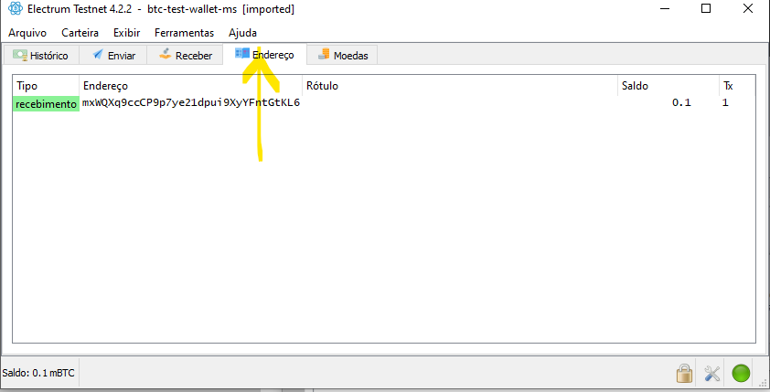

## Projeto: Criando e Utilizando a Sua Carteira de Criptomoedas
Esse projeto visa desenvolver um gerenciador de carteira e realizar transações com bitcoin.
Vamos gerar endereços públicos e chaves privadas.Usá-los para realizar transações e verificar.

## Tecnologias:
<p>


</p>

## Autor
- Nome        : Marco Antonio de Sena Campos
- Instituição : Digital Innovation One
- Turma       : Formação Blockchain Specialist
- Professor   : Cassiano Peres

## Contatos: 
Email   : msena2210@gmail.com

Linkedin: https://www.linkedin.com/in/marco-sena-b5558526/

Git     : https://github.com/MarcoSena2210/

### #dio.io
## Projeto:
- [Criando e Utilizando a Sua Carteira de Criptomoedas](https://github.com/MarcoSena2210projeto-carteira-de-criptomoedas)

## Tópicos 
- [Pré-requisitos](https://github.com/MarcoSena2210/projeto-carteira-de-criptomoedas/#pr%C3%A9-requisitos)

- [Descrição do Projeto](https://github.com/MarcoSena2210/projeto-carteira-de-criptomoedas/pr%C3%A9-Descriçãodoprojeto)

- [Objetivo](https://github.com/MarcoSena2210/projeto-carteira-de-criptomoedas/pr%C3%A9-Descriçãodoprojeto)

- [Preparação do Ambiente](https://github.com/MarcoSena2210/projeto-carteira-de-criptomoedas/pr%C3%A9-PreparaçãodoAmbiente)

- [Criando o projeto]

- [Gerador de carteiras de bitcoin]

- [Enviando e recebendo transações]

- [Conclusão]

## Pré-requisitos
Para melhor compreensão e execução do projeto é necessário conhecimentos básicos (fundamentos) em:
javascript,
lógica de programação. 


## Descrição do projeto

Esse projeto tem como objetivo desenvolver os conhecimentos iniciais no curso de [BlockChain](https://github.com/MarcoSena2210/???) promovido pela Dio Innovation One no segundo semestre de 2022.

Descrever de forma simples os passos para atingir o objetivo de aprendizafgem dessa tecnologia. 

## Objetivos:
  a) Construir um gerador de carteiras de bitcoin

  b) Importar para dentro de um software gerenciador de carteiras

  c) Realizar transações de envio e recebimentode de Bitcoin 


⚠ **Observação: Todas as imagens de exemplo abaixo (Visualizações) são apenas para referencias e podem sofrer mudanças as suas atualizações.


## Preparação do ambiente
  * Baixar e Instalar o nodesjs

    [nodejs](https://nodejs.org/en/download/)
    Um framework de execução Javascript linguagem padrão de manipulação de páginas HTML.

  * Baixar e Instalar o visual code.

    [Visual Code](https://code.visualstudio.com/download)
    Ide muito usada pelos desenvoldores para editar código fontes.  

 * Baixar e Instalar o Electrum.    
    [Electrum](https://electrum.org/#home)
    Ferramenta usada para enviar e receber transações de criptomoedas.  


    ### Passo a passo

      1-Criar uma pasta no computador e dentro dela abrir o vscode. 

      Foi criado a pasta "blockchain\btcwalett", entretanto você pode colocar qualquer nome desejado. 

      2-Abra um terminal dentro do vscode.
      Para isso, basta clicar na barra subperior em terminal.Será aberto na parte inferior da tela um prompt de comando.
      Semelhante a imagem abaixo:        

    ```
    OUTPUT
    indows PowerShell
    Copyright (C) Microsoft Corporation. Todos os direitos    reservados.

    Experimente a nova plataforma cruzada PowerShell https://aka.ms/pscore6
 
    PS D:\Blockchain\btcwalett> 
    ```

    3-Verificar se o nodejs está instalado:
    No prompt do terminal digite node -v, esse comando irá mostrar a versão instalada do nodejs.
    Se mostrar a versão, foi instalado com sucesso. 

    PS D:\Blockchain\btcwalett>`node -v`
    ``` 
    Output
    v16.16.0
    ```

    4-Verificar se o npm (gerenciador de package) está instalado:
    No prompt do terminal digite nmp -v, esse comando irá mostrar a versão instalada do npm.
    Se mostrar a versão, foi instalado com sucesso. 


    PS D:\Blockchain\btcwalett> `npm -v`

    ```
    Output 
    npm WARN config global `--global`, `--local` are deprecated. Use `--location=global` instead.
    8.11.0

    ``` 


### ⚠ Observação: Se apareceu a versão, significa que foi instalado corretamente.   
### Caso contrário, refaça a instalação do nodejs.

## Criando o projeto 

    ### 1-Para criar o projeto basta digitar `npm init -y` na pasta desejada.Dentro do terminal do Visual Code 
    PS D:\Blockchain\btcwalett>`npm init -y`
    ```
    OUTPUT
    npm WARN config global `--global`, `--local` are deprecated. Use `--location=global` instead.
    Wrote to D:\Blockchain\btcwalett\package.json:

    {
      "name": "btcwalett",
      "version": "1.0.0",
      "description": "Brockchain - 1ª projeto",
      "main": "index.js",
      "scripts": {
        "test": "echo \"Error: no test specified\" && exit 1"
      "author": "",
      "license": "ISC"
    }
    ```

## 2- Criar algumas dependências(packages) necessárias

    PS D:\Blockchain\btcwalett>`npm install bip39 bip32@2.0.6 bitcoinjs-lib --save`
    ```
    OUTPUT 
    npm WARN config global `--global`, `--local` are deprecated. Use `--location=global` instead.

    added 38 packages, and audited 39 packages in 29s

    1 package is looking for funding
      run `npm fund` for details

    found 0 vulnerabilities
    npm notice
    npm notice New minor version of npm available! 8.11.0 -> 8.15.1
    npm notice Changelog: https://github.com/npm/cli/releases/tag/v8.15.1      
    npm notice Run npm install -g npm@8.15.1 to update!
    npm notice
    PS D:\Blockchain\btcwalett> 
    ```

## Gerador de carteiras de bitcoin

    ### 3-Para melhor organização criar uma pasta src (source) e dentro dela o arquivo "createWallet.js" e digitar o código necessário.  

    ### ⚠ O código fonte encontra-se na pasta ..\src\createWallet.js
    
    Ele será responsável por criar nossas carteira, criar as chaves públicas e privadas.
    _____________________________

    ### 4-Para executar o código do arquivo "createWallet.js", no terminal vamos entrar na pasta src (cd .\src\) e depois para executar o código, no prompt do terminal digite: node .\createWallet.js

    PS D:\Blockchain\btcwalett>`cd .\src\`

    PS D:\Blockchain\btcwalett\src>`node .\createWallet.js`

    ## ⚠ Pode levar um pouco de tempo processando, aguarde... 

    # O resultados foi:
    ``` 
    Output
    Carteira gerada
    Endereço:  mxWQXq9ccCP9p7ye21dpui9XyYFntGtKL6
    Chave privada: cTFF5u9wfUeryYuW6vfSbG9uKkfDxKdVnJj3wQ5wgBk1nnQ9HPBM
    Seed: potato true client question outdoor nurse insect whip keep review equip gossip
    PS D:\Blockchain\btcwalett\src> 
    ```

⚠ Caso ainda não tenha instalado o Electrum, vamos fazer o download do Electrum e instalar agora. https://electrum.org/#home


# Enviando e recebendo transações  

    Aqui acabamos de criar nossa carteira no Eletrum
    

    ## ⚠ Dica: Acesse a ferramenta e navegue para entender o que tem de opções.

    ## Vamos pegar o nosso endereço da carteira gerada e acessar o blockchain.com

    Acesse blockchain.com clicando em: https://www.blockchain.com/search?search=mxWQXq9ccCP9p7ye21dpui9XyYFntGtKL6

    ### 6º -  Copiei o endereço gerado no script do visual code e cole ou digite no buscador do app blockchain

    

    


    ### 6º -  Vamos agora adiquirir nossas moedas sem valor, para teste acessando "Bitcoin Testnet Faucet".É uma moeda que não tem nenhum valor.
    Acesse : https://bitcoinfaucet.uo1.net/

    Vamos receber 0001 bitcoin, cricando no 3 conforme figura abaixo. 

    

    


    Conferindo no bockchain, isso equivaleria a 2 dolares  
    


    ## Neste momento, ele está aguardando ser validado pelo bloco.

    ## ⚠ Dica IMPORTANTE: Ativar a tesnet no eletrum, precisamos alterar uma propriedade.
    ## No atalho do Electrum clica com o botão direiro --> propriedades --> target no final da linha após " acrescentar --testnet

    

    A linha ficará assim: 
    "C:\Program Files (x86)\Electrum\electrum-4.2.2.exe" --testnet

    ## Importar para dentro de um software gerenciador de carteiras

    ### 7º - Vamos criar uma nova carteira e importar a chave privada. Através do Electrum.
    


    

    #### Informando a chave privada gerada anteriormente.
    

    #### Criar uma senha qualquer.
    


    #### Clique na aba endereço. Podemos observar que é o mesmo criado anteriormente.
    #### Em histórico podemos verificar se a transação já foi concluída.

  ## ⚠ Dica: Só podemos enviar após está concluída. A tela ficará assim:
  

  

  

  

  ### 8º -  Agora vamos enviar para outro endereço.
  #### Para efetuar essa operação iremos criar um novo endereço,executando o nosso script createwallet. Depois entrar no Electrum,selecionar a moeda desejada e clicar na aba enviar e informar o endereço para quem desejamos enviar.

  ### Antes vamos rodar nosso programa para gerar o novo endereço:
  PS D:\Blockchain\btcwalett\src> `node .\createWallet.js`
  Nova carteira
  ```
  OUTPUT
  Carteira gerada
  Endereço:  mkwkWoR3Yg6jXDXDC3CW3df18mrF8emSf7
  Chave privada: cUEMeUavZBtiac4c9FpmhaX6mJGhrQBP2aYikkzj78kovyEJrAfv
  Seed: spot scare level december truly knife bacon shy inject maple ozone shoot
  PS D:\Blockchain\btcwalett\src>  
  ```

  ### 9º - Agora é só copiar o novo endereço e colocar no Elctrum.
  ## ⚠ Dica: Copiei o valor e informe no campo valor e clicar no botão pagar.
  

  #### Pagamento ennviado e projeto concluído.
  

  #### Mas ainda não foi confirmada
  

  #### Vamos verificar como está lá no BlokChain?
  #### Podemos observar os 2 hash que foram gerados das 2 transações e o total enviado para o novo endereço.

  

  

  
  #### Clicando no hash, será aberto apágina de detalhe.
  Dica: Na linha Include bkock pode aparecer  o descritivo "Mempool" o que significa que ainda não foi validada.No nosso caso já foi validada.   
  Fig 29 

  
  


CONCLUSÂO:

  - ✅  a) Construir um gerador de carteiras de bitcoin
        Criado o script createWallet.js   

  - ✅  b) Importar para dentro de um software gerenciador de carteiras
        Feito a importção da moeda com sucesso

  - ✅ c) Realizar transações de envio e recebimentode de Bitcoin 
        Feito a transações de envio da moeda com sucesso

  Com esse aprendizado, concluímos a nossa primeira experiência de criação de criptomoedas.Fica aqui meus agradecimentos ao professor Cassiano Peres e a toda equipe da Dio.      

  ______________________________________________
  Este repositório é um fork do [Cassiano Peres](https://github.com/digitalinnovationone/formacao-blockchain-dio.git)

